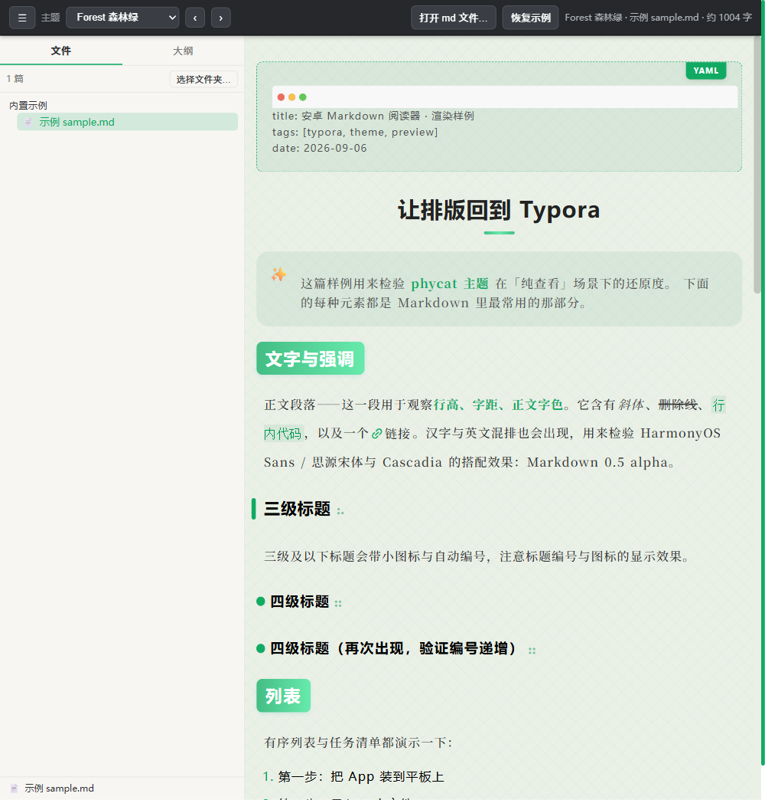

# phycat-md-reader · 安卓 Markdown 阅读器

> 一款面向 **安卓平板/手机** 的 Markdown **纯阅读器**：导入 → 书架 → 阅读。
> 阅读区排版、配色、字体**复刻 Typora 观感**，内置 9 套 phycat 主题，随时换肤。



---

## 📥 下载 & 在线体验

| 入口 | 说明 |
|---|---|
| **下载 APK** | [⬇ 最新版 APK 直链](https://github.com/C-silence/phycat-md-reader/releases/latest/download/phycat-md-reader-v0.1-debug.apk)（约 31MB，Android 7.0+，需允许"未知来源"） |
| **版本记录** | 各版本与更新说明见 [Releases](https://github.com/C-silence/phycat-md-reader/releases) |
| **在线体验** | [🌐 打开浏览器 Demo](./theme-preview/) —— 用真实 Markdown 预览 9 套主题渲染与换肤，效果与 App 阅读页一致 |

## ✨ 功能

- **导入**：SAF 选择单个 `.md` / 整个文件夹（递归收 `.md`，≤8 层 / 300 个）；也支持其它 App 用「打开方式 / 分享」把 md 发进来。
- **书架**：左侧文件库按目录分组、可折叠；大纲页签实时生成 H1~H6 结构，滚动阅读自动高亮、点击跳转。
- **阅读**：复刻 Typora 排版。支持标题自动编号、表格、代码块、引用、任务清单（复选框可勾选、正文划线）、front-matter、图片、内嵌 HTML。
- **换肤**：内置 8 亮 + 1 暗共 9 套 phycat 主题，随时切换，暗色联动。

> ⚠️ 当前为纯查看器（不编辑/不写回磁盘）；文库目前为会话内记忆，重启回到内置示例（M2 持久化规划中，见下方路线）。

## 🛠 从源码构建

前置：JDK 17+、Android SDK（compileSdk 36）。

```bash
# 1. 同步网页资源进 assets（首次/每次改动 theme-preview 后必跑）
cd android
python tools/sync_assets.py

# 2. 构建（macOS/Linux 用 gradlew；以下为示例）
export JAVA_HOME=/path/to/jdk21
export ANDROID_HOME=/path/to/Android/Sdk
./gradlew assembleDebug
# 产物：android/app/build/outputs/apk/debug/app-debug.apk
```

> 工程路径含中文时，`gradle.properties` 已加 `android.overridePathCheck=true` 规避报错。
> 本机 `android/local.properties`（sdk.dir）不入库，换机后自行创建。

## 📁 目录结构

```
├── README.md                 本说明 / GitHub Pages 首页
├── 项目文档.md                需求、技术决策、路线图（M0~M4）
├── 开发总结.md                续作/交接手册
├── downloads/                本地 APK 暂存（不入库；对外分发走 GitHub Release）
├── phycat-*.css  (9 套)       配色主题（套用自 phycat，勿改）
├── phycat/                   基础样式 + 字体（勿拆散）
├── theme-preview/            ★ 阅读页唯一逻辑源（浏览器可直接打开 / Pages 在线 demo）
│   ├── index.html            渲染 + fidelity shim + 侧栏 + 换肤
│   ├── vendor/markdown-it.min.js
│   └── shots/                渲染效果截图
└── android/                  Android 工程（WebView 壳 + SAF 导入 + JS 桥）
    ├── app/src/main/java/... MainActivity.java
    ├── app/src/main/assets/app/   ← 由 tools/sync_assets.py 生成（不入库）
    └── tools/sync_assets.py  一键同步脚本
```

## 🧠 核心思路：怎么"复刻 Typora"

- **渲染载体 = WebView**。Markdown → HTML 后包进 `<div id="write">`，phycat 的 CSS 原样生效，观感≈Typora，几乎零翻译成本。
- **fidelity shim**：markdown-it 输出的 HTML 与 Typora DOM 不同，脚本给标题补 `md-heading`、代码块补 `md-fences`、front-matter 转 `md-meta-block`、任务清单转 `li.task-list-item` + 可点击复选框。
- **换肤 = 换 `<link>`** 指向的配色 css，沿 `@import` 链自动带基础样式与字体。
- 维护铁律：**网页逻辑只改 `theme-preview/index.html` 一份**，安卓用 `sync_assets.py` 同步后再构建。

## 🗺 路线

- ✅ M0 浏览器预览页（9 主题 + 侧栏）
- ✅ M1 Android 壳 + 可安装 APK
- ⬜ M2 文库持久化（重启记忆、SAF 授权保持）
- ⬜ M3 字号调节、阅读位置记忆、真机观感打磨
- ⬜ M4 KaTeX / mermaid / 代码高亮 / 本地图片解析

## 📜 致谢 / 第三方许可

- **主题样式**：套用自 **[sumruler/typora-theme-phycat](https://github.com/sumruler/typora-theme-phycat)**（[MIT](https://github.com/sumruler/typora-theme-phycat/blob/main/LICENSE)），本仓库内的 `phycat-*.css` / `phycat/` 均源自该项目并保持原结构。
- **字体**：思源宋体 CN（SIL OFL）、HarmonyOS Sans、Cascadia Code（OFL）。
- **Markdown 渲染**：[markdown-it](https://github.com/markdown-it/markdown-it)（MIT，已本地化，离线可用）。
- 本仓库阅读器外壳代码（Compose/HTML/JS）为原创，未另行声明许可时保留所有权。

---

*配套文档：`项目文档.md`、`开发总结.md`、`android/README.md`。*
